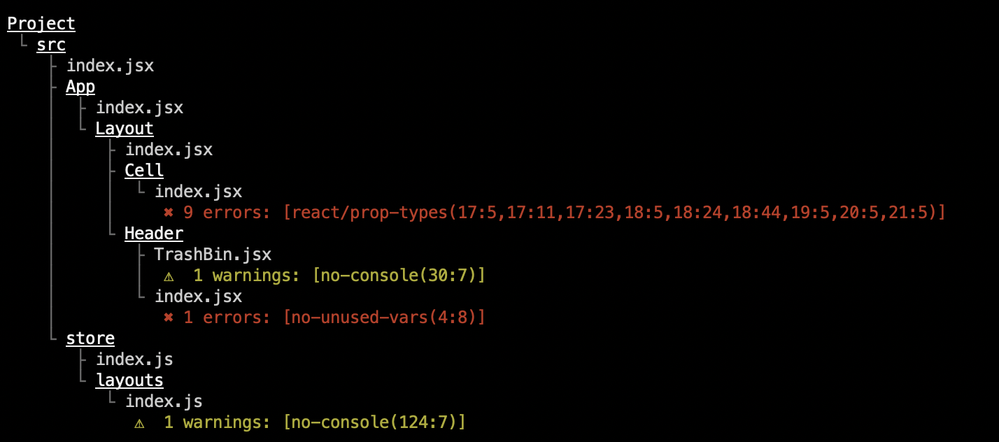

# ESLint Overview Formatter

A simple formatter for ESLint, which prints an overview of a project showing offending files in a tree structure.

Install with NPM

```bash
$ npm install eslint-overview-formatter --save-dev
```

## Usage and output

The output looks something like this, listing all files with errors or warnings. Errors and warnings are listed as an array of objects with the shape _RULE_**(**_LINE_**:**_COLUMN_**)**



To use a custom formatter with ESLint, you can pass the `--format` (or `-f`) flag the path for the formatter. If you installed with NPM;

```bash
$ eslint --format ./node_modules/eslint-overview-formatter .
```

form the project root should do the trick.

## Show all files

If you want to show all files in the project, errors or not, you can set an environment variable called `OVERVIEW_FORMATTER_SHOW_ALL` to true.

```bash
$ OVERVIEW_FORMATTER_SHOW_ALL=true eslint --format ./node_modules/eslint-overview-formatter .
```